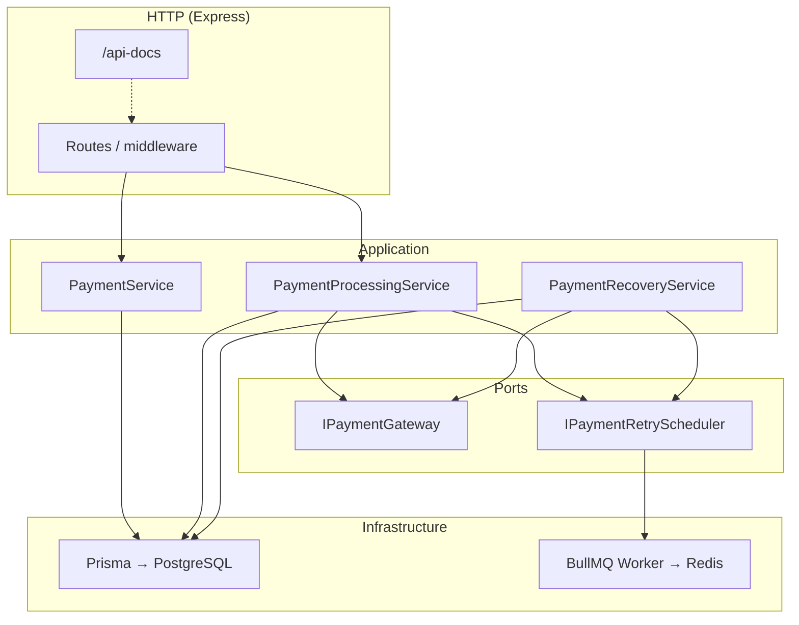

# Payment Processing API

A production-minded **payment orchestration service** built with **Node.js**, **Express**, **PostgreSQL**, **Prisma**, and **Redis (BullMQ)**. It exposes idempotent payment initiation, synchronous processing hooks against an injectable gateway abstraction, asynchronous webhook ingestion, structured observability, and recovery paths for stuck `Processing` rows.

This repository is structured as a **backend take-home / assignment submission**: clear boundaries, explicit concurrency and consistency strategies, integration tests with deterministic mocks, and containerized deployment.

---

## 1. Project overview

| Capability | Description |
|------------|-------------|
| **Payments** | Create charges (`POST /payments`), query status (`GET /payments/:id`), drive gateway execution (`POST /payments/:id/process`). |
| **Idempotency** | HTTP `Idempotency-Key` + database uniqueness prevent duplicate inserts under retries and races. |
| **Retries** | Optional delayed jobs on Redis with **stable job IDs** per payment and **exponential backoff** between attempts. |
| **Webhooks** | PSP callbacks (`POST /webhooks/payment`) with early-queue semantics, duplicate safety, and conflict handling vs terminal `Success`. |
| **Recovery** | Background sweep reconciles **expired processing leases** using optional gateway status probes. |
| **Observability** | Pino structured logs (correlation IDs), `GET /metrics` aggregates, Swagger/OpenAPI UI. |

---

## 2. Architecture

The application follows a **layered hexagonal style**: HTTP adapters call application services; persistence and queues are infrastructure.



- **`PaymentService`** — idempotent initiation and reads.
- **`PaymentProcessingService`** — claims work, calls gateway, finalizes attempts, schedules retries.
- **`PaymentRecoveryService`** — periodic reconciliation for stale `Processing` leases (runs in-process when enabled).
- **`bootstrapPaymentProcessing`** — wires gateway implementation, Redis-backed scheduler + worker when `PAYMENT_RETRY_ENABLED` and `REDIS_URL` are set.

---

## 3. Payment lifecycle

Payments are modeled as an aggregate with status **`Pending` → `Processing` → (`Success` | `Failed`)**. (`Processing` may revert to `Pending` after a retryable failure or recovery.)

1. **Initiation** — `POST /payments` inserts or returns an existing row keyed by `Idempotency-Key`; initial status **`Pending`**.
2. **Processing** — `POST /payments/:id/process` transitions **`Pending` → `Processing`** inside a transaction, creates an **`PaymentAttempt`**, invokes **`IPaymentGateway.processPayment`**, then **`Success`** or returns to **`Pending`** / **`Failed`** depending on gateway outcome and retry limits.
3. **Webhook path** — PSP may confirm asynchronously; webhook ingestion can finalize **`Success`** / **`Failed`** or queue events before correlation.

Terminal **`Failed`** occurs when **`retryCount >= maxRetries`** after a failed attempt.

---

## 4. Idempotency strategy

- Clients send **`Idempotency-Key`** on **`POST /payments`** (required). The middleware rejects requests without it (`MISSING_IDEMPOTENCY_KEY`).
- The database enforces **unique `idempotencyKey`** on `Payment`.
- Creation uses a **transaction** with conflict handling: concurrent inserts that hit uniqueness reconcile by reloading the winning row so duplicate logical charges are not created.

---

## 5. Retry strategy

- After **retryable** failures (payment remains **`Pending`** and **`retryCount < maxRetries`**), the service schedules a **delayed job** on BullMQ when **`PAYMENT_RETRY_ENABLED=true`** and **`REDIS_URL`** is configured.
- **Backoff**: \( \text{delay} = \min(\text{maxDelay},\ \text{baseDelay} \cdot 2^{\min(\text{retryCount}-1,\ \text{cap})}) \) (implemented in `payment-retry.policy.ts`).
- **Deduplication**: job ID **`payment-retry:<paymentId>`** avoids stacking duplicate delayed jobs for the same payment while Redis still shows an active/waiting job.

---

## 6. Concurrency control strategy

- **Serializable transactions** are used for claiming and finalizing payments to reduce anomalies under concurrent processors.
- **`SELECT … FOR UPDATE`** row locks serialize transitions on the same aggregate.
- **`Processing` lease** (`lockedUntil`): only one active processor “owns” the row within the lease window; overlapping **`POST …/process`** calls observe **`skipped_busy`** or wait for lease expiry / completion.
- Concurrent **`POST /payments`** with the same idempotency key converge on **one persisted row** via DB uniqueness + transactional flow.

---

## 7. Webhook handling strategy

- Each delivery persists a **`WebhookEvent`** row then applies transitions under **row locks** keyed by **`gatewayReferenceId`**.
- **Early webhook** (no payment row yet): responds **`202`** with outcome **`queued_early_no_payment`**; events are **replayed** when `gatewayReferenceId` is later attached during processing.
- **Duplicates**: repeated success deliveries resolve to safe outcomes such as **`already_success`** without corrupting terminal state.
- **Conflict safety**: a **`failed`** callback after **`Success`** is **ignored** (`ignored_failed_vs_success_conflict`) to protect charge integrity.

---

## 8. Data consistency and recovery strategy

- **Authoritative state** lives in PostgreSQL; attempts and webhook events provide an audit trail.
- **Stale `Processing`**: if a processor crashes, **`lockedUntil`** eventually expires; **`PaymentRecoveryService`** runs a batched sweep:
  - Optionally probes **`IPaymentGateway.getChargeStatus`** when a gateway reference exists.
  - Applies **success reconciliation** or **local failure** + retry scheduling consistent with retry caps.
- **Migrations** applied on container start (`prisma migrate deploy`) keep schema version aligned with the running binary.

---

## 9. API documentation

- **Interactive OpenAPI (Swagger UI):** **`GET /api-docs`** after the server is running.
- **Machine-readable spec:** `docs/openapi.yaml` (same contract served by Swagger UI).

Primary documented operations include **`POST /payments`**, **`GET /payments/:id`**, **`POST /webhooks/payment`**, **`GET /health`**, **`GET /metrics`**.

---

## 10. How to run locally

### Prerequisites

- **Node.js 20+**
- **PostgreSQL 16+** (or use Docker only for DB — see below)
- **Redis** (only if enabling retries)

### Setup

```bash
cd payment-system
cp .env.example .env
# Edit DATABASE_URL / REDIS_URL as needed
npm ci
npx prisma migrate deploy
npm run build   # optional; dev uses tsx
npm run dev
```

### Database & Redis via Docker (API still on host)

```bash
docker compose up -d postgres redis
# Point DATABASE_URL and REDIS_URL in .env to localhost:5432 / localhost:6379
npx prisma migrate deploy
npm run dev
```

### Full stack in Docker

```bash
docker compose up --build
```

- API: **http://localhost:3000**
- Swagger: **http://localhost:3000/api-docs**
- Postgres: `localhost:5432`, Redis: `localhost:6379` (as exposed in `docker-compose.yml`)

---

## 11. How to run tests

```bash
npm ci
npm test
```

Tests use **Jest**, **Supertest**, and an **in-memory Prisma-shaped client** (no real Postgres required). The suite includes a **comprehensive integration checklist** covering initiation, idempotency, gateway outcomes, retries, concurrency, webhooks, recovery, and validation.

```bash
npm run build    # TypeScript compile check
```

---

## 12. Known assumptions & limitations

1. **Gateway implementation** — The default **`FakeExternalGatewayService`** simulates latency and probabilistic outcomes for demos; production would swap **`IPaymentGateway`** for a real PSP client with deterministic tests around adapters.
2. **Horizontal scaling** — In-process **BullMQ worker** and **recovery timer** run **inside the API process**. Multiple replicas without coordination would **duplicate workers/sweeps**; production would externalize workers or use leader election / partitioned queues.
3. **`GET /metrics`** — Operational aggregate endpoint; **not** a Prometheus exposition format and **not** authenticated in this scaffold (gate behind auth/network policy in real deployments).
4. **PCI scope** — Card data must never be logged; clients should not send PAN/CVV to this API — only amounts, currency, and gateway references as applicable.
5. **Webhook authenticity** — Signature verification (e.g. HMAC headers) is **not implemented**; assumed trusted network or future middleware.

---

## 13. Bonus features implemented

| Feature | Notes |
|---------|--------|
| **OpenAPI + Swagger UI** | `docs/openapi.yaml`, served at **`/api-docs`**. |
| **Structured logging** | Pino with **`event`**, **`requestId`**, **`paymentId`**, **`metadata`**, sanitization of sensitive fields. |
| **Correlation IDs** | Middleware accepts/propagates **`X-Request-Id`** / **`X-Correlation-Id`**. |
| **Metrics endpoint** | **`GET /metrics`** — totals, counts by status, retry summaries. |
| **Docker & Compose** | Multi-stage **`Dockerfile`**, **`docker-compose.yml`** with **API + Postgres + Redis**. |
| **Integration test suite** | Deterministic mocks; concurrency and webhook edge cases; recovery scenarios. |
| **Health check** | **`GET /health`** probes DB; Docker **`HEALTHCHECK`** uses the same endpoint. |

---

## Author / submission notes

This project demonstrates **clear domain modeling**, **safe retries**, **explicit concurrency**, **webhook idempotency**, and **operational hygiene** suitable for a **mid-level / full-stack backend** assessment. For questions or extensions (real PSP adapter, webhook signing, multi-region deployment), see inline code comments and OpenAPI examples.
